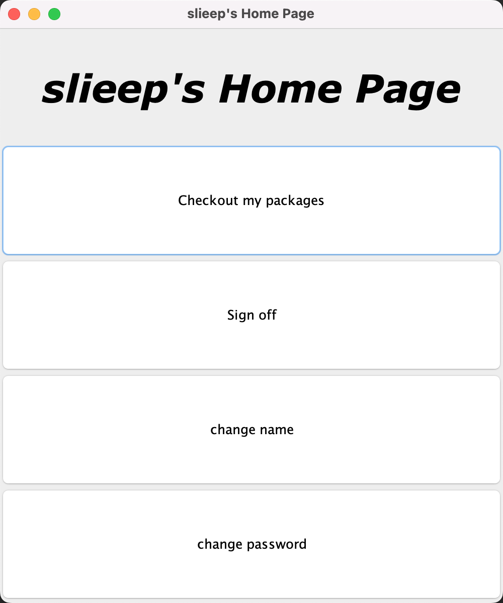
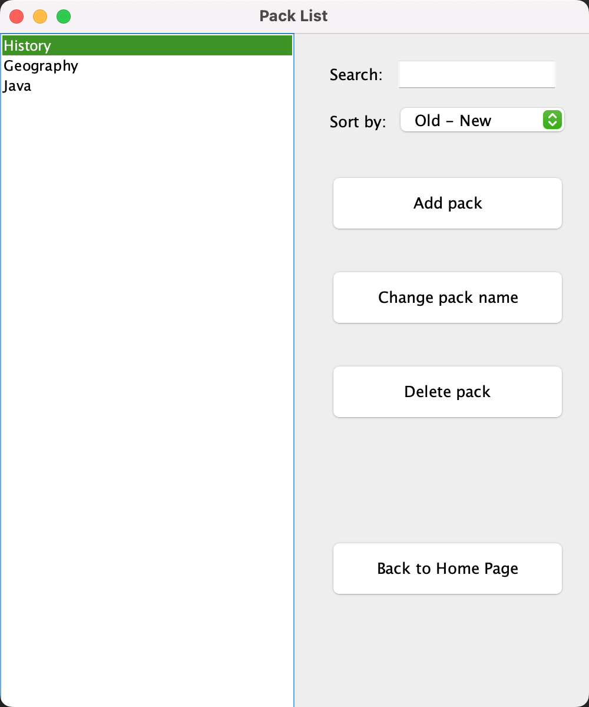
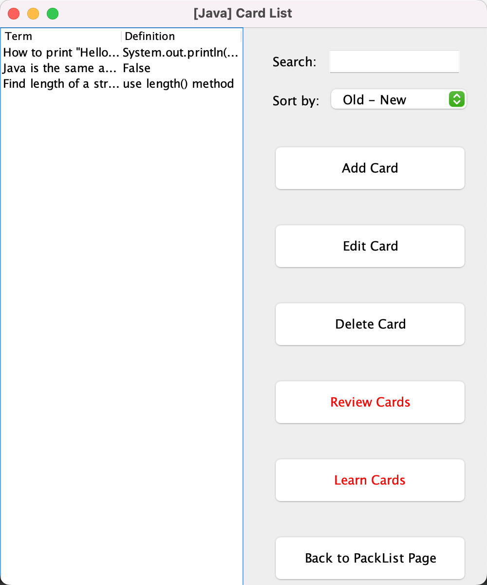
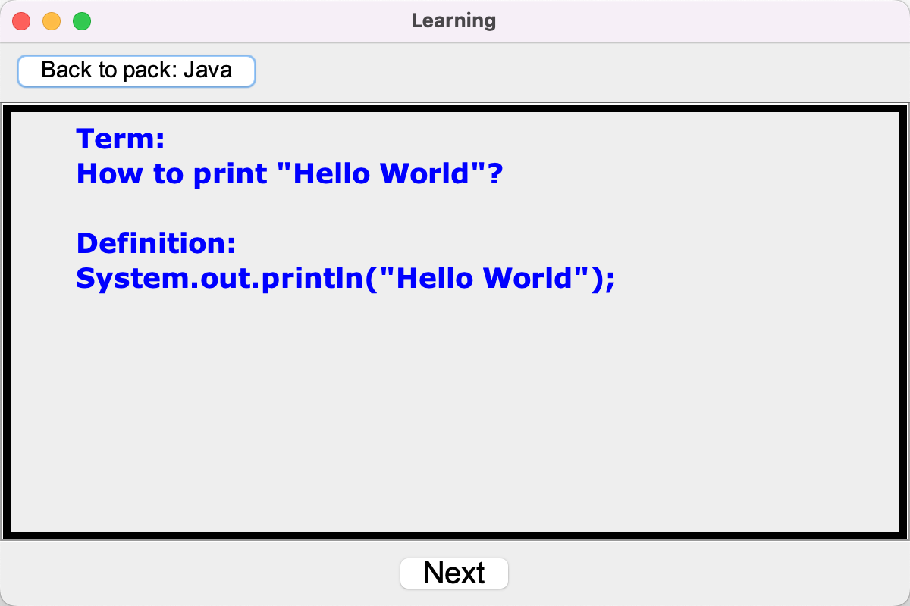
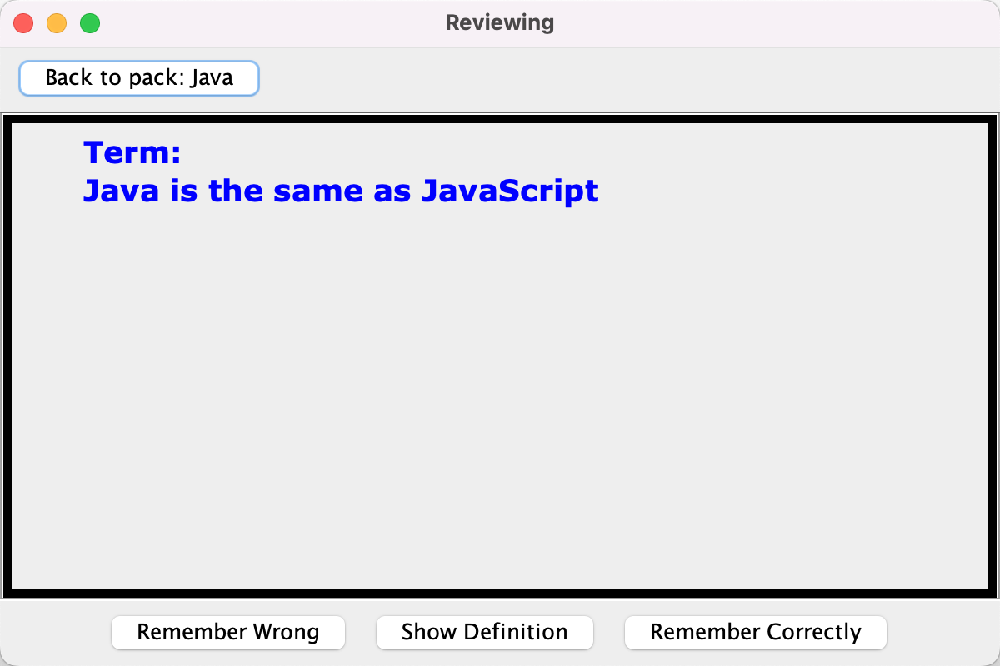

## Recaller Flashcard Learning Platform

### 🎗I. Intro
A platform that helps users to memorize. 
Users can create **packages** to categorize contents they want to memorize:
- Each package can contain multiple cards.
- Each card contains a **term** and **definition**.

There are two modes for memorizing:
1. **Learning Mode**: going over all cards in a package, with both term and definition shown
2. **Reviewing Mode**: showing only term. Users can choose "remember wrongly", "remember correctly", and "show definition".

### 🥳 II. Demo
1. Home Page:

2. Package List Page:

3. Package Page

4. Learning Page

5. Reviewing Page

### 🙋🏼‍ III. How to Use the platform?
1. Make sure you have installed JDK 11.0+.
2. Clone the repo and run the java code from [`src/main/java/main/Main.java`](src/main/java/main/Main.java)

Note: This is a group project from Course CSC207 at UofT. 
